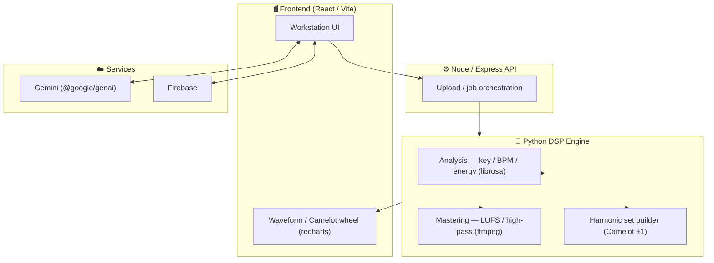

 

# 🎚️ AuraTone AI — Architecture Showcase

### AI-assisted audio mastering & harmonic-mixing engine

*Public architecture write-up of a proprietary system — how AuraTone analyzes,
masters and harmonically sequences tracks. **No source code included.***

> 🔒 **Source code is private & proprietary.** Documentation only.
> © 2026 Kevin Kuck — All Rights Reserved. Demo / access on request.

---

## 📋 What is AuraTone AI?

AuraTone is a **DJ / production workstation**: it analyzes audio (key, BPM, energy),
masters it to loudness targets, and builds **harmonically coherent sets** — a software
replacement for hardware analysis/mastering workflows, with Gemini assistance on top.

## 🏗️ System Architecture

## ✨ Capabilities

| Module | What it does |
|---|---|
| **Analysis** | Key, BPM and energy detection (librosa-based). |
| **Mastering** | Loudness normalization to a LUFS target, high-pass, artifact cleanup (ffmpeg). |
| **Harmonic mixing** | Camelot-style key flow (±1 step) → coherent sets/playlists. |
| **Interop** | Traktor Pro import/export (`.nml`). |
| **AI assist** | Gemini for guidance/automation around the DSP core. |
| **Delivery** | Web app **and** native macOS app launcher. |

## 🧰 Tech & APIs

**React + Vite + Tailwind** (UI) · **Express/Node** (API) · **Python DSP** (librosa, ffmpeg) ·
**Google Gemini** (`@google/genai`) · **Firebase** · **recharts** (visualization) ·
native macOS app packaging.

## 🎯 Engineering Notes

- **Hybrid TS + Python**: React/Express front, Python for the heavy DSP — clean separation of UI and signal processing.
- **Loudness-correct mastering** targeting broadcast/club LUFS levels with a 30 Hz high-pass and artifact removal.
- **Harmonic coherence** enforced algorithmically (Camelot wheel) for smooth transitions.

## 🎬 Demo

> _Placeholder — Demo-Video / Screenshots folgen._
> <!--  -->

## 📄 License & Copyright

**© 2026 Kevin Kuck — All Rights Reserved.** Architecture documentation only; the AuraTone
source code is proprietary and not included here.

Built by Kevin Kuck · KKI

