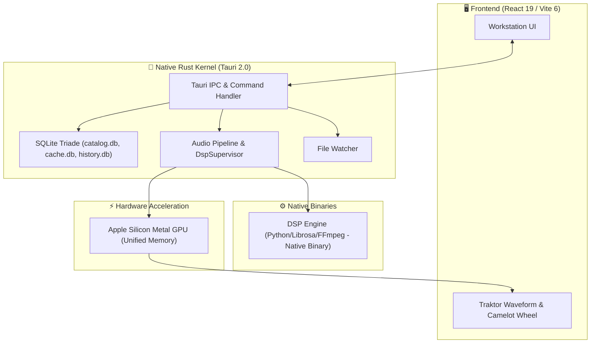

  <h1>🎚️ AuraTone Architecture</h1>
  
<b>A local-first Apple-Silicon architecture for audio analysis, harmonic curation, waveform rendering and controlled mastering workflows.</b>

  
<i>(Architecture Specification & Engineering Blueprint Repository)</i>

  
  
  
  

 

[📄 **Download Architecture Showcase (PDF)**](./docs/AuraTone_AI_v2.0_Architecture_Showcase.pdf) · [🌐 **Open Interactive Web Showcase**](./docs/architecture_showcase.html)

## 🎯 Architectural Vision

AuraTone AI is designed as a standalone macOS desktop workstation. It guarantees data sovereignty by running analysis and audio pipelines entirely locally on Apple Silicon, without relying on persistent cloud connections or exposing user data.

- **Platform:** macOS / Apple Silicon (`aarch64`)
- **Core:** Rust, Tauri 2, Tokio, SQLite
- **Audio:** FFmpeg, AVFoundation/CoreAudio strategy, DSP-Sidecar
- **GPU:** Metal Compute für Waveform-Peak-Pyramiden
- **Privacy:** Analyse und Audiomaterial standardmäßig lokal
- **Status:** Private implementation in active development; this repository documents architecture and engineering decisions.

---

## 🏗️ System Context

```mermaid
graph TB
    subgraph UI["🖥️ Frontend (React 19 / Vite 6)"]
        APP["Workstation UI"]
        VIZ["Traktor Waveform & Camelot Wheel"]
    end

    subgraph TAURI["🦀 Native Rust Kernel (Tauri 2.0)"]
        IPC["Tauri IPC & Command Handler"]
        DB["SQLite Triade (catalog.db, cache.db, history.db)"]
        PIPE["Audio Pipeline & DspSupervisor"]
        FS["File Watcher"]
    end
    
    subgraph SIDECARS["⚙️ Native Binaries"]
        DSP["DSP Engine (Python/Librosa/FFmpeg - Native Binary)"]
    end

    subgraph GPU["⚡ Hardware Acceleration"]
        METAL["Apple Silicon Metal GPU (Unified Memory)"]
    end

    APP <--> IPC
    IPC --> DB & PIPE & FS
    PIPE --> DSP
    PIPE --> METAL
    METAL --> VIZ
```

---

## 🛠️ Design Principles

1. **Local-first Privacy:** Alle Audiodaten, Metadaten und Machine-Learning-Berechnungen verbleiben auf der Hardware des Nutzers. Cloud-Erweiterungen (z.B. Gemini AI) sind strikt als Opt-In konzipiert.
2. **Native Performance:** Anstatt Electron und Node.js nutzt die Architektur einen schlanken Rust-Kernel (Tauri 2), der direkten Zugriff auf das macOS-Dateisystem, FSEvents und die Metal GPU bietet.
3. **Hermetische Sidecars:** Komplexe Python-basierte Audio-Machine-Learning-Pipelines (z.B. Librosa) sind in native ARM64-Binaries gebündelt, um Abhängigkeitsprobleme bei der Auslieferung zu vermeiden.
4. **Resilientes Datenmodell:** Eine "3-Way SQLite Triade" isoliert den Katalog, Caching und Audit-Logs, um maximale Nebenläufigkeit und Datensicherheit bei Pipeline-Crashes zu garantieren.

---

## 📁 Repository Documentation

- [Architecture Details](docs/architecture.md)
- [Runtime & Sidecars](docs/runtime-and-sidecars.md)
- [Audio Pipeline](docs/audio-pipeline.md)
- [Waveform & Metal GPU](docs/waveform-and-metal.md)
- [Data & Reliability](docs/data-and-reliability.md)
- [Privacy & Security](docs/privacy-and-security.md)
- [Release Strategy](docs/release-strategy.md)

*(This repository is a technical showcase. The actual source code remains proprietary and private.)*

---

## 🤝 Contact

Developed & Architected by **Kevin Kuck** (Senior System Architect & Lead AI Engineer).

- 👔 **LinkedIn:** [Kevin Kuck](https://www.linkedin.com/in/kevin-kuck-it)
- 🦊 **GitLab:** [KKEEY92](https://gitlab.com/KKEEY92)
- 📄 **Interactive Portfolio:** [CV_IT_KKEEY](https://kkeey92.github.io/CV_KKEEY/)
- 🤝 **Contact & Hiring:** Bereit für High-End Freelance Consulting, KI-Architekturen & Native Desktop Engineering.

> *"Bridging Apple Silicon Metal Hardware with Autonomous AI Reasoning."*
