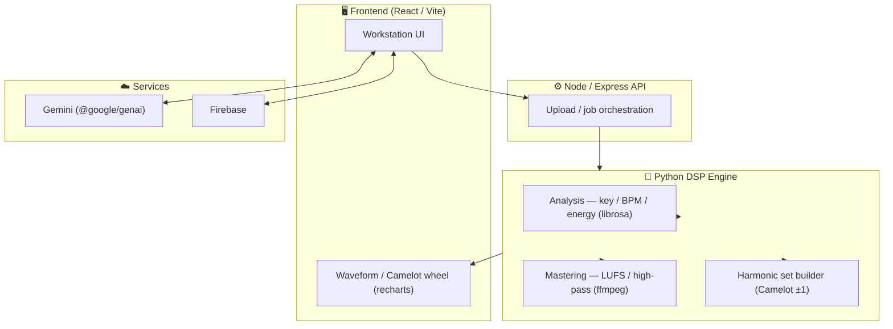

  <h1>🎚️ AuraTone AI (Architecture)</h1>
  
<b>Public Architecture Showcase of a Proprietary Audio AI System</b>

  
  
  
  
  

 

> 🔒 **Source code is private & proprietary.** Documentation only.
> © 2026 Kevin Kuck — All Rights Reserved. Demo / access on request.

## 🎯 Executive Summary (Business Value)

This repository serves as a **public architectural showcase** of **AuraTone AI** — a proprietary DJ and audio production workstation. 

AuraTone proves that heavy Digital Signal Processing (DSP) and Artificial Intelligence (Gemini) can be combined efficiently in a web-native environment. By separating the visual interface from the Python-based audio engine, AuraTone achieves automated mastering, harmonic sequencing (Camelot), and Traktor Pro 4 integrations without latency bottlenecks.

---

## 🏗️ System Architecture

```mermaid
graph TB
    subgraph UI["🖥️ Frontend (React / Vite)"]
        APP["Workstation UI"]
        VIZ["Waveform / Camelot wheel (recharts)"]
    end
    subgraph API["⚙️ Node / Express API"]
        UP["Upload / job orchestration"]
    end
    subgraph DSP["🐍 Python DSP Engine"]
        ANA["Analysis — key / BPM / energy (librosa)"]
        MAST["Mastering — LUFS / high-pass (ffmpeg)"]
        HARM["Harmonic set builder (Camelot ±1)"]
    end
    subgraph EXT["☁️ Services"]
        GEM["Gemini (@google/genai)"]
        FB["Firebase"]
    end
    
    APP --> UP --> DSP
    DSP --> ANA & MAST & HARM
    APP <--> GEM
    APP <--> FB
    DSP --> VIZ
```

### ✨ Capabilities

| Module | What it does |
|---|---|
| **Analysis** | Key, BPM and energy detection (librosa-based). |
| **Mastering** | Loudness normalization to a LUFS target, high-pass, artifact cleanup (ffmpeg). |
| **Harmonic mixing** | Camelot-style key flow (±1 step) → coherent sets/playlists. |
| **Interop** | Traktor Pro import/export (`.nml`). |
| **AI assist** | Gemini for guidance/automation around the DSP core. |
| **Delivery** | Web app **and** native macOS app launcher. |

---

## 🎯 Engineering Notes

- **Hybrid TS + Python**: React/Express front, Python for the heavy DSP — clean separation of UI and signal processing.
- **Loudness-correct mastering** targeting broadcast/club LUFS levels with a 30 Hz high-pass and artifact removal.
- **Harmonic coherence** enforced algorithmically (Camelot wheel) for smooth transitions.

---

## 💼 About the Architect (Available for Freelance)

Built and architected by **Kevin Kuck**. 
I specialize in bridging the gap between cutting-edge Artificial Intelligence and polished, native Apple ecosystems. 

**Looking for an expert to build or scale your next AI product?**
- 👨‍💻 **Role:** IT-Support Specialist | AI Architect | Apple Developer
- 👔 **LinkedIn:** [Kevin Kuck](https://www.linkedin.com/in/kevin-kuck-it)
- 🦊 **GitLab:** [KKEEY92](https://gitlab.com/KKEEY92)
- 📄 **Interactive CV & Portfolio:** [CV_IT_KKEEY](https://kkeey92.github.io/CV_IT_KKEEY/)
- 🤝 **Hire Me:** Available for freelance consulting, architecture design, and full-stack AI development.
